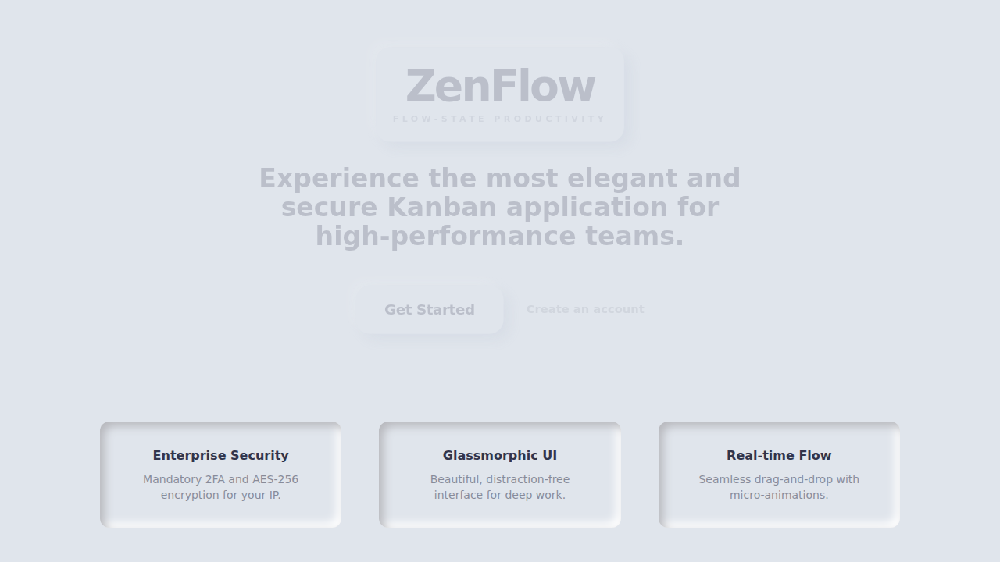
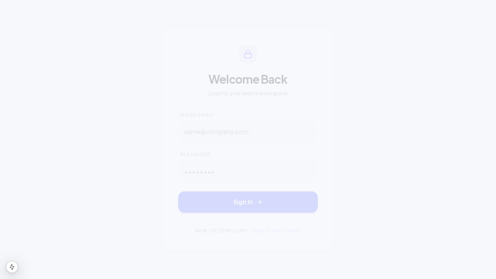
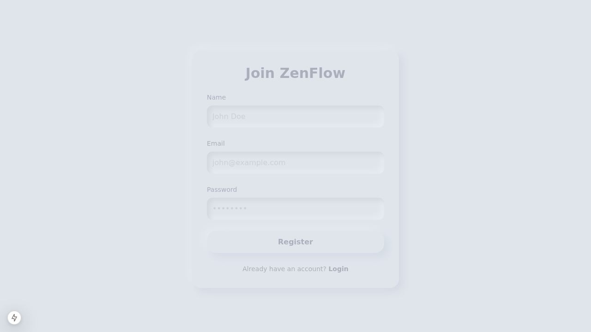

# ZenFlow

ZenFlow is a premium, highly secure, and visually immersive Kanban application designed for high-performance teams. Unlike generic project management tools, ZenFlow focuses on a "flow-state" user experience—combining aesthetic elegance with enterprise-grade security and seamless mobile responsiveness.

## Screenshots

### Landing Page


### Secure Login


### User Registration


## Key Features

- **Advanced Security**: Email/Password authentication with Bcrypt hashing and Two-Factor Authentication (2FA) via TOTP (Google Authenticator/Authy).
- **Kanban Engine**: Dynamic columns with drag-and-drop functionality for tasks.
- **Neumorphic Design**: A modern, clean aesthetic using subtle shadows and glassmorphic elements.
- **Responsive UI**: "Mobile-First" approach ensuring usability across all device sizes.
- **Real-time Persistence**: Changes are automatically saved to the backend.

## Requirements

### Local Development
- **Node.js**: v18.x or higher
- **npm**: v9.x or higher
- **SQLite**: (Included via Prisma)

### Server Deployment
- **Node.js Runtime**: v18+
- **Database**: SQLite (default), PostgreSQL, or MySQL (via Prisma configuration)
- **Environment Variables**: See `.env.example`
- **Memory**: Minimum 1GB RAM recommended
- **Storage**: Sufficient space for the SQLite database and attachments

## Two-Factor Authentication (2FA) Setup Guide

ZenFlow requires Two-Factor Authentication to ensure the highest level of security for your data. Follow these steps to set up and use Google Authenticator with ZenFlow:

### 1. Install Google Authenticator
Download and install the **Google Authenticator** app from the [App Store (iOS)](https://apps.apple.com/us/app/google-authenticator/id388497605) or [Google Play Store (Android)](https://play.google.com/store/apps/details?id=com.google.android.apps.authenticator2).

### 2. Register a New Account
- Navigate to the **Register** page.
- Enter your name, email, and a secure password.
- Upon successful registration, you will be redirected to the Login page.

### 3. Obtain Your 2FA Secret
- Log in with your new credentials.
- You will be redirected to the **Two-Factor Authentication** page.
- **Demo Mode Note**: In this version, your unique 2FA secret is displayed in a box on the screen. In a production environment, this would typically be a QR code.

### 4. Link Google Authenticator
- Open the Google Authenticator app on your mobile device.
- Tap the **"+"** icon and select **"Enter a setup key"**.
- Enter **"ZenFlow"** as the Account name.
- Type in the **Secret Key** displayed on the ZenFlow 2FA page.
- Ensure "Type of key" is set to **"Time-based"** and tap **"Add"**.

### 5. Verify and Login
- Google Authenticator will now generate a 6-digit code for ZenFlow that changes every 30 seconds.
- Enter the current 6-digit code into the input field on the ZenFlow 2FA page.
- Click **"Verify & Continue"** to enter your dashboard.

## Installation

1. **Clone the repository**:
   ```bash
   git clone <repository-url>
   cd zenflow
   ```

2. **Install dependencies**:
   ```bash
   npm install
   ```

3. **Set up Environment Variables**:
   Copy `.env.example` to `.env` and fill in your secrets.
   ```bash
   cp .env.example .env
   ```

4. **Initialize the Database**:
   ```bash
   npx prisma db push
   ```

5. **Start the development server**:
   ```bash
   npm run dev
   ```

The application will be available at `http://localhost:3000`.

## Testing

### Automated Core Verification
We provide a script to verify core security and database logic:
```bash
node scripts/test-zenflow.js
```

### Visual Verification
You can run Playwright tests (if configured) or manually verify the UI by navigating through the registration and login flows.

## Roadmap

- **Phase 1 (MVP)**: Secure Login, 2FA, Basic Kanban (Add/Move/Delete).
- **Phase 2**: Swimlanes, WIP limits, and File Attachments.
- **Phase 3**: Advanced Analytics (Burn-down charts) and custom themes.

## License

MIT
